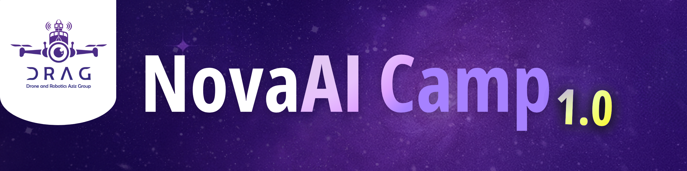
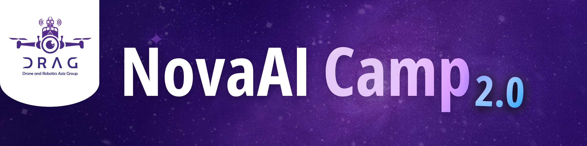

# NovaAI Camp - AI Bootcamp Series
**By DRAG (Data Research & AI Group) - King Abdulaziz University**

A comprehensive AI education program from fundamentals to advanced deep learning.

---



## 🎓 NovaAI Camp 1.0 - AI Fundamentals

*Introduction to Python, Data Science, and Machine Learning basics*

# will be added soon

---



## 🚀 NovaAI Camp 2.0 - Machine Learning Deep Dive

*Hands-on ML: From scratch implementations to production-ready models*

### **Day 1: Machine Learning Foundations**
*ML framework, Data problems, and Splitting strategies*

| Lecture | Slides | Notebooks |
|---------|--------|-----------|
| TBA | TBA | [NumPy for ML](https://github.com/AbdulellahMoj/DRAG_NovaAi_Camp/blob/main/NovaAi2.0/Day1_NumPy_for_ML.ipynb) • [](https://colab.research.google.com/github/AbdulellahMoj/DRAG_NovaAi_Camp/blob/main/NovaAi2.0/Day1_NumPy_for_ML.ipynb)<br>[Pandas Basics & EDA](https://github.com/AbdulellahMoj/DRAG_NovaAi_Camp/blob/main/NovaAi2.0/Day1_Pandas_Basics_and_EDA.ipynb) • [](https://colab.research.google.com/github/AbdulellahMoj/DRAG_NovaAi_Camp/blob/main/NovaAi2.0/Day1_Pandas_Basics_and_EDA.ipynb)<br>[Pandas Exercises](https://github.com/AbdulellahMoj/DRAG_NovaAi_Camp/blob/main/NovaAi2.0/Day1_Pandas_EDA_Exercises.ipynb) • [](https://colab.research.google.com/github/AbdulellahMoj/DRAG_NovaAi_Camp/blob/main/NovaAi2.0/Day1_Pandas_EDA_Exercises.ipynb)<br>[ML From Scratch](https://github.com/AbdulellahMoj/DRAG_NovaAi_Camp/blob/main/NovaAi2.0/Day1_ML_From_Scratch.ipynb) • [](https://colab.research.google.com/github/AbdulellahMoj/DRAG_NovaAi_Camp/blob/main/NovaAi2.0/Day1_ML_From_Scratch.ipynb)<br>[Scikit-Learn Basics](https://github.com/AbdulellahMoj/DRAG_NovaAi_Camp/blob/main/NovaAi2.0/Day1_SK-Learn_Basics.ipynb) • [](https://colab.research.google.com/github/AbdulellahMoj/DRAG_NovaAi_Camp/blob/main/NovaAi2.0/Day1_SK-Learn_Basics.ipynb) |

### **Day 2: Machine Learning Algorithms**
*Linear, Distance-based, Kernel-based, and Tree-based models*

| Lecture | Slides | Notebooks |
|---------|--------|-----------|
| TBA | TBA | TBA |

### **Day 3: Fundamentals of Deep Learning**
*Neural Networks, Deep Learning, Learning Process (Backpropagation), and Optimizers*

| Lecture | Slides | Notebooks |
|---------|--------|-----------|
| TBA | TBA | TBA |

### **Day 4: Unsupervised Learning**
*K-Means clustering, PCA, t-SNE, and Autoencoders*

| Lecture | Slides | Notebooks |
|---------|--------|-----------|
| TBA | TBA | TBA |

---

## 🧠 NovaAI Camp 3.0 - Deep Learning & Neural Networks

*Advanced AI: CNNs, RNNs, Transformers, and Modern Architectures*

# TBA

---

## 📚 Repository Structure

```
DRAG_NovaAi_Camp/
├── NovaAi1.0/          # AI Fundamentals (Python, ML basics)
├── NovaAi2.0/          # ML Deep Dive (Day 1 materials available)
├── NovaAi3.0/          # Deep Learning (TBA)
├── extra/              # Supplementary materials
└── assets/             # Images and resources
```

---

**Made by DRAG Team 💜**  
Follow us on X [@DRAGKAU](https://x.com/DRAGKAU)
